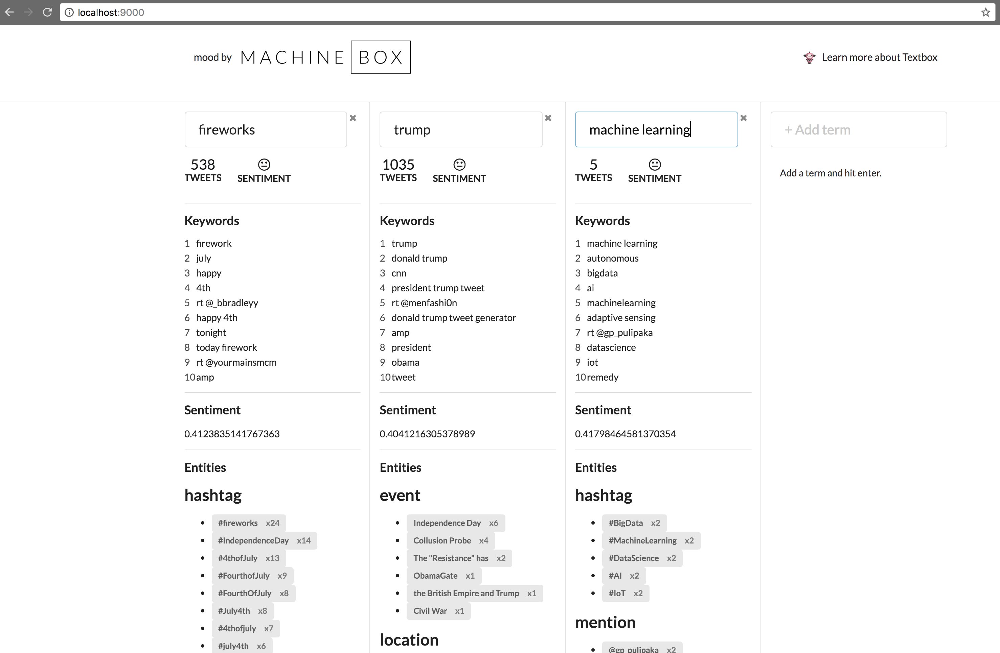

# Mood by machinebox 

Mood live streams tweets, and analyses the content using [Textbox](https://machinebox.io/docs/textbox).




## Requirements

### Enviroment variables to connect with Twitter

To Run the app you need the following enviroment variables to be able to connect to Twitter.

```
MOOD_COSUMER_KEY=consumer_key
MOOD_CONSUMER_SECRET=secret
MOOD_ACCESS_TOKEN=token
MOOD_ACCESS_SECRET=access_secret
```

To get a the values you can visit [Twitter Apps](https://apps.twitter.com/) where you can generate the keys for running it.

### Textbox

The NLP analysis (keywords, entities, sentiement) is done using [Textbox](https://machinebox.io/docs/textbox) make sure you have an instance of textbox running on http://localhost:8080

## Run Mood

From the root directory just:

```
$ go build

$ ./mood
mood by Machine Box - https://machinebox.io/

Go to: :9000...
```

Visit http://localhost:9000 and enjoy!

This application is for hacking! Play and Change it.


